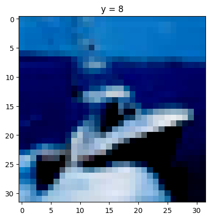

# CIFAR CNN

## Описание проекта
Проект является учебным и направлен на создание и оптимизацию свёрточной нейронной сети для классификации изображений из датасета CIFAR-10 во фреймворке PyTorch. Основной задачей является изучение влияния различных методов (таких как Dropout и аугментации) на процесс обучения и производительность модели. 

Примеры избражения из исходного датасета:

### Постановка задачи
Необходимо создать во фреймворке pytorch свёрточную нейронную сеть без skip connections для классификации изображений из датасета CIFAR10. Затем необходимо построить графики функции потерь на тренировке и валидации. Добавить в архитектуру сети dropout. Убрать dropout и использовать аугментации при обучении. Исследовать, как влияет dropout и аугментации на процесс обучения. Посчитать с стандартные метрики классификации (recall, precision, F1, rocauc, MCC, accuracy).  
Разобраться как изменяются размерности тензора при прохождении через нейронную сеть, как работает функция потерь.

## Структура проекта

Структура проекта

1. Оптимизация первичной структуры нейронной сети
- Создание модели (Построение начальной версии свёрточной нейронной сети (CNN) без skip connections, определение структуры сети (количество слоёв, количество нейронов в каждом слое, функции активации и т.д.))
- Обучение модели (Обучение начальной модели на тренировочном наборе данных CIFAR-10, визуализация и анализ графиков функции потерь на тренировочном и валидационном наборах данных)
- Корректировка модели (Анализ результатов и внесение изменений для улучшения производительности)

2. Расширение архитектуры сети
- Добавление слоёв (Включение дополнительных слоёв в текущую архитектуру сети )
- Нормализация (Применение нормализации к исходным изображениям (например, Batch Normalization), проверка влияния нормализации на качество обучения модели)

3. Эксперименты с архитектурой и обучением
- Polling (Исследование различных методов пуллинга (Max Pooling, Average Pooling) и их влияние на производительность сети)
- Оптимизаторы (Эксперименты с разными оптимизаторами (Adam, SGD))
- Dropout (Добавление слоя Dropout в архитектуру сети и изучение его влияния на процесс обучения и качество модели, сравнение результатов с и без Dropout)
- Аугментация (Применение различных методов аугментации данных и исследование их влияния на производительность сети)

## Результаты работы

В ходе создания и обучения нами моделей мною были получены следующие графики:

- SimpleCNN 

Архитектура модели

----------------------------------------------------------------
        Layer (type)               Output Shape         Param #

            Conv2d-1            [-1, 6, 28, 28]             456
         MaxPool2d-2            [-1, 6, 14, 14]               0
            Conv2d-3           [-1, 16, 10, 10]           2,416
         MaxPool2d-4             [-1, 16, 5, 5]               0
            Linear-5                  [-1, 120]          48,120
            Linear-6                   [-1, 10]           1,210
----------------------------------------------------------------

Для 30 эпох обучения получаем следующие метрики - Loss: 0.5929, Test Accuracy: 64.05 %

Графики обучения модели

- NotSimpleCNN 

Архитектура модели

----------------------------------------------------------------
        Layer (type)               Output Shape         Param #

            Conv2d-1           [-1, 16, 32, 32]             448
       BatchNorm2d-2           [-1, 16, 32, 32]              32
         MaxPool2d-3           [-1, 16, 16, 16]               0
            Conv2d-4           [-1, 32, 16, 16]           4,640
       BatchNorm2d-5           [-1, 32, 16, 16]              64
         MaxPool2d-6             [-1, 32, 8, 8]               0
            Conv2d-7             [-1, 64, 8, 8]          18,496
       BatchNorm2d-8             [-1, 64, 8, 8]             128
         MaxPool2d-9             [-1, 64, 4, 4]               0
           Linear-10                  [-1, 256]         262,400
           Linear-11                   [-1, 10]           2,570
----------------------------------------------------------------

Для 30 эпох обучения получаем следующие метрики - Loss: 0.0812, Test Accuracy: 72.09 %

Графики обучения модели

- PoolingCNN 

Архитектура модели

----------------------------------------------------------------
        Layer (type)               Output Shape         Param #

            Conv2d-1           [-1, 16, 32, 32]             448
       BatchNorm2d-2           [-1, 16, 32, 32]              32
         MaxPool2d-3           [-1, 16, 16, 16]               0
            Conv2d-4           [-1, 32, 16, 16]           4,640
       BatchNorm2d-5           [-1, 32, 16, 16]              64
         MaxPool2d-6             [-1, 32, 8, 8]               0
            Linear-7                  [-1, 256]         524,544
            Linear-8                   [-1, 10]           2,570
----------------------------------------------------------------

Графики обучения модели

- Использование Аугментации для исходных изображений

Графики обучения модели

## Итоговая сеть
В результате иследований мы полуможем сформировать итоговую архитектуру нейронной сети, тогда после её обучения на 30ти эпохах, мы получаем следующие резальтаты:

- Epoch [30], Loss: 0.2800, Test Accuracy: 80.90 % 

Архитектура итоговой сети

----------------------------------------------------------------
        Layer (type)               Output Shape         Param #

            Conv2d-1           [-1, 16, 32, 32]             448
       BatchNorm2d-2           [-1, 16, 32, 32]              32
         MaxPool2d-3           [-1, 16, 16, 16]               0
            Conv2d-4           [-1, 32, 16, 16]           4,640
       BatchNorm2d-5           [-1, 32, 16, 16]              64
         MaxPool2d-6             [-1, 32, 8, 8]               0
            Conv2d-7             [-1, 64, 8, 8]          18,496
       BatchNorm2d-8             [-1, 64, 8, 8]             128
         MaxPool2d-9             [-1, 64, 4, 4]               0
           Linear-10                  [-1, 256]         262,400
           Linear-11                   [-1, 10]           2,570
----------------------------------------------------------------

## Использованные библиотеки
Проект использует следующие библиотеки:

- random: для генерации случайных чисел и задания начальных параметров.
- numpy: для работы с массивами и математическими операциями.
- pandas: для обработки и анализа данных.
- matplotlib: для 2D визуализации данных.
- seaborn: для улучшенной визуализации данных на основе matplotlib.
- torch: для построения и обучения нейронных сетей.
- torchvision: для загрузки и предобработки данных изображений.
- torchsummary: для визуализации структуры нейронных сетей.
- sklearn: для расчета метрик классификации.

## Структура репозитория
- **optimizer_SGD.ipynb**: Jupyter Notebook с кодом, реализующим визуализацию градиентного спуска.
- **requirements.txt**: Файл со списком зависимостей, необходимых для запуска кода.

## Как использовать проект
1. Склонируйте репозиторий на свой компьютер.
2. Установите необходимые зависимости, указанные в файле `requirements.txt`.
3. Запустите Jupyter notebook `CIFAR_CNN.ipynb`, следуя инструкции в нём.

## Контактная информация
Если у вас есть вопросы или предложения по улучшению проекта, свяжитесь со мной:
- Email: maximgoltsov@gmail.com

<!-- 
4. Визуализация и анализ результатов
Графики:
Построение графиков функции потерь на тренировочном и валидационном наборах данных.
Визуализация изменения метрик в процессе обучения.
Метрики классификации:
Расчёт стандартных метрик классификации: recall, precision, F1-score, ROC AUC, MCC, accuracy.
Анализ полученных метрик и выводы о качестве модели.
Заключение:
Сравнение результатов различных экспериментов (с Dropout и без, с аугментацией и без). -->
